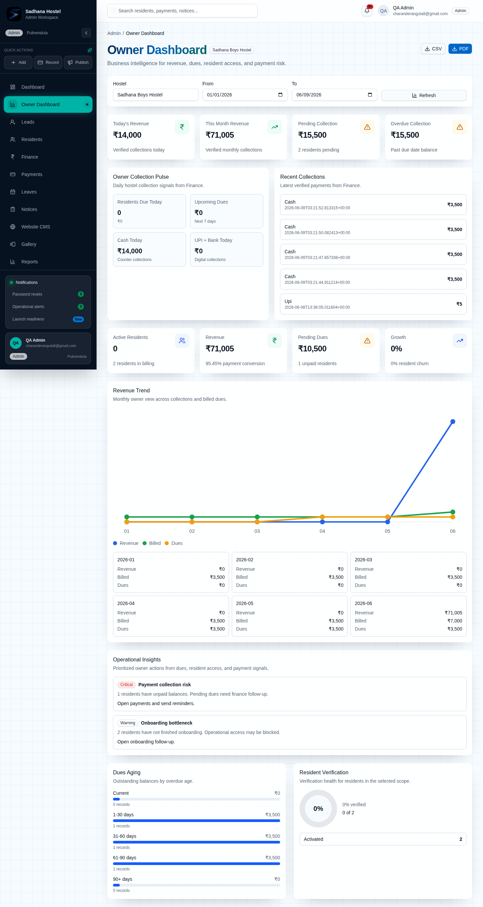
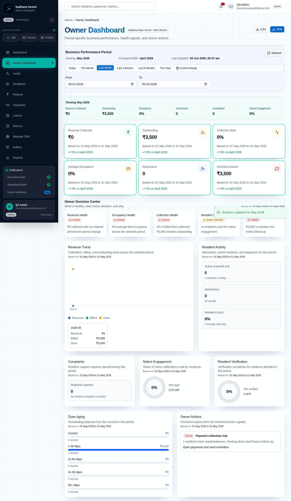
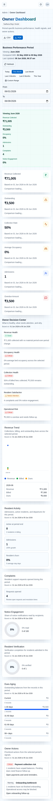

# Owner Analytics UX V3 Report

Date: June 9, 2026

## Screenshots

### Before

### After

### After - Mobile

The before screenshot was rendered from the pre-change Git `HEAD`; the after screenshots use the completed production build against the same local tenant.

## UX Improvements

- Renamed the filter area to **Business Performance Period**.
- Added explicit **Viewing**, **Compared With**, and **Last Updated** labels.
- Added Today, This Month, Last Month, Last 3 Months, Last 6 Months, This Year, and Custom Range presets with a visible active state.
- Added initial loading copy, refresh copy, skeletons, a completion toast, and temporary KPI highlighting.
- Added a period summary band for revenue, outstanding dues, occupancy, admissions, complaints, and notice engagement.
- Added previous-period comparisons to every primary KPI.
- Added exact **Based on** ranges to charts and widgets.
- Added Revenue, Occupancy, Collection, Resident Satisfaction, and Operational Risk decisions with Good, Needs Attention, or Critical status and reasons.
- Added the selected-period empty state instead of zero-heavy analytics.
- Updated CSV/PDF controls to show the period being exported and export that exact range.
- Removed current-day/all-time finance widgets that silently ignored the selected analytics dates.

## Files Changed

- `src/components/admin/analytics/owner-dashboard-client.tsx`
- `src/lib/analytics/owner-period.ts`
- `src/hooks/use-analytics.ts`
- `src/sdk/analytics.sdk.ts`
- `src/services/analytics.service.ts`
- `src/repositories/analytics.repository.ts`
- Related unit and SDK regression tests

## Validation Results

- Desktop visual check: passed; no incoherent overlap found.
- Mobile visual check at 390 x 844: passed; controls, KPIs, decisions, charts, and widgets remain readable.
- Last Month interaction: May 2026 loaded, comparison changed to April 2026, and the update toast appeared.
- CSV/PDF exact-range browser verification: passed.
- Lint, TypeScript, unit/security tests, and production build: passed.
- Full smoke suite has three unrelated pre-existing failures documented in `OWNER_DASHBOARD_FIX_REPORT.md`.
